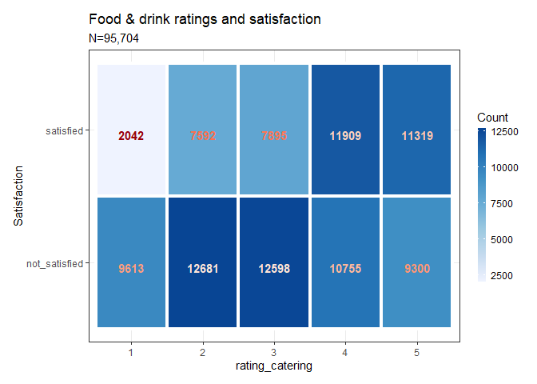

Classification - Airline satisfaction analysis
================
Ahmet Zamanis

-   <a href="#purpose" id="toc-purpose">Purpose</a>
-   <a href="#data-preparation" id="toc-data-preparation">Data
    Preparation</a>
-   <a href="#exploratory-analysis"
    id="toc-exploratory-analysis">Exploratory analysis</a>
    -   <a href="#distributions" id="toc-distributions">Distributions</a>
    -   <a href="#relationships" id="toc-relationships">Relationships</a>
    -   <a href="#correlations" id="toc-correlations">Correlations</a>
-   <a href="#classification-models"
    id="toc-classification-models">Classification models</a>
    -   <a href="#logistic-regression" id="toc-logistic-regression">Logistic
        regression</a>
    -   <a href="#decision-trees" id="toc-decision-trees">Decision trees</a>
    -   <a href="#random-forest" id="toc-random-forest">Random forest</a>
-   <a href="#conclusion" id="toc-conclusion">Conclusion</a>

## Purpose

Classification models aim to divide observations into pre-defined
categories, using supervised learning algorithms. This analysis aims to
handle a typical binary classification problem: Classifying airline
passengers as satisfied or not satisfied with the service, using a large
dataset of mostly factor predictors.

## Data Preparation

The Airline Passenger Satisfaction dataset was [sourced from
Kaggle](https://www.kaggle.com/datasets/teejmahal20/airline-passenger-satisfaction),
shared by user [TJ Klein](https://www.kaggle.com/teejmahal20).  
  
The dataset is pre-split into a training and testing dataset. We will
carry out our analysis and modeling on the training dataset, and test
our models’ accuracy on the testing dataset. We load the training
dataset, which includes 103,904 observations and 23 variables.  

| Age | Type.of.Travel  | Class    | Flight.Distance | Inflight.wifi.service |
|----:|:----------------|:---------|----------------:|----------------------:|
|  13 | Personal Travel | Eco Plus |             460 |                     3 |
|  25 | Business travel | Business |             235 |                     3 |
|  26 | Business travel | Business |            1142 |                     2 |
|  25 | Business travel | Business |             562 |                     2 |
|  61 | Business travel | Business |             214 |                     3 |

Original training data

  
The dataset includes 23 columns, excluding the ID columns.

-   Customer satisfaction is going to be our binary outcome variable
    (satisfied or not satisfied/neutral).
-   Numeric variables are age, flight distance, arrival delay and
    departure delay in minutes.
-   Nominal (unordered) factor variables are gender, customer loyalty
    (loyal or disloyal), type of travel (personal or business) and class
    (business, eco, ecoplus).
-   Ordered factor variables are the 1-5 satisfaction ratings for
    various aspects of service, such as:
    -   Wifi service,
    -   Convenience of departure and arrival time,
    -   Ease of online booking,
    -   Gate location,
    -   Food and drink,
    -   and 9 more ratings.

We will rename the columns, and the values for factor variables, into
shorter yet still intuitive strings. We will also ensure each variable
is converted into the proper class, numeric or factor, and ensure the
rating columns are leveled from 1 to 5. We will also remove the “n” and
ID columns.  

  
There are some observations with no values for arrival delay. Since
arrival delay is zero for almost all observations, we can replace these
missing values with zeroes. Also, there are some observations with
missing values for some service ratings. We remove these observations
and end up with 95,704 observations.  

| class    | distance | rating_wifi | rating_timely | rating_onlinebooking |
|:---------|---------:|:------------|:--------------|:---------------------|
| ecoplus  |      460 | 3           | 4             | 3                    |
| business |      235 | 3           | 2             | 3                    |
| business |     1142 | 2           | 2             | 2                    |
| business |      562 | 2           | 5             | 5                    |
| business |      214 | 3           | 3             | 3                    |

Cleaned training data

  
We load our testing data, and perform the same operations. We end up
with 23,863 observations.

## Exploratory analysis

### Distributions

Let’s summarize our dataset, and start with checking the balances of our
factor variables.  

    ##     gender          loyalty           age          travel_type   
    ##  female:48483   disloyal:15385   Min.   : 7.00   business:66106  
    ##  male  :47221   loyal   :80319   1st Qu.:28.00   personal:29598  
    ##                                  Median :40.00                   
    ##                                  Mean   :39.81                   
    ##                                  3rd Qu.:51.00                   
    ##                                  Max.   :85.00                   
    ##       class          distance    rating_wifi rating_timely rating_onlinebooking
    ##  business:46464   Min.   :  31   1:16588     1:15212       1:16842             
    ##  eco     :42241   1st Qu.: 438   2:24707     2:16982       2:23248             
    ##  ecoplus : 6999   Median : 867   3:24757     3:17615       3:23622             
    ##                   Mean   :1222   4:18783     4:24481       4:18733             
    ##                   3rd Qu.:1773   5:10869     5:21414       5:13259             
    ##                   Max.   :4983                                                 
    ##  rating_gate rating_catering rating_onlineboarding rating_seat rating_entertain
    ##  1:16066     1:11655         1: 9950               1:10799     1:11097         
    ##  2:17923     2:20273         2:16602               2:13534     2:16009         
    ##  3:26179     3:20493         3:20715               3:17222     3:17384         
    ##  4:22403     4:22664         4:29087               4:29655     4:27712         
    ##  5:13133     5:20619         5:19350               5:24494     5:23502         
    ##                                                                                
    ##  rating_onboard rating_legroom rating_baggage rating_checkin rating_inflight
    ##  1:10863        1: 9402        1: 6370        1:12021        1: 6259        
    ##  2:13612        2:17838        2:10550        2:12062        2:10496        
    ##  3:20761        3:18421        3:19303        3:26201        3:18997        
    ##  4:28751        4:27082        4:34761        4:26798        4:35228        
    ##  5:21717        5:22961        5:24720        5:18622        5:24724        
    ##                                                                             
    ##  rating_clean  delay_depart   delay_arrive            satisfaction  
    ##  1:12121      Min.   :   0   Min.   :   0.00   not_satisfied:54947  
    ##  2:14727      1st Qu.:   0   1st Qu.:   0.00   satisfied    :40757  
    ##  3:22634      Median :   0   Median :   0.00                        
    ##  4:25294      Mean   :  15   Mean   :  15.32                        
    ##  5:20928      3rd Qu.:  13   3rd Qu.:  13.00                        
    ##               Max.   :1592   Max.   :1584.00

<!-- --><!-- -->  
Some of our factor variables are balanced, while some are very
unbalanced.

-   Our outcome variable, satisfaction, is slightly unbalanced. Keep in
    mind that the value not_satisfied includes customers whose
    satisfaction is classified as “neutral”, as well as those classified
    as unsatisfied.
-   Gender is roughly balanced 50-50%. Travel purpose is unbalanced
    roughly 70-30% towards business travelers.
-   Customer loyalty is very unbalanced, roughly 85-15% towards
    customers classified as loyal.
-   Class is roughly 49% business, 44% eco and 7% eco plus.

Next, let’s look at the distributions of our numerical variables with
histograms.

<!-- -->  
Age appears to be reasonably close to normally distributed. Our dataset
is representative of all age groups.  
  
<!-- -->  
Flight distance is very right skewed. The mean flight distance,
influenced by few observations with very high distances, is considerably
higher than the median distance. Most flights in our dataset have
shorter distances, less than 1,000-1,250.  
  
<!-- -->

<!-- -->

-   Departure delay is zero for the vast majority of observations, and
    the mean, influenced by few high value observations, is still barely
    15 minutes.
-   Arrival delays paint a very similar picture to departure delays.
    Mostly zero values, and a mean of 15.32 minutes influenced by few
    high value observations.

  
Let’s look at the distributions of our service rating variables, which
are ordinal factor variables ranked from 1 to 5. Since there are 14
service categories in our dataset, let’s try to visualize all of them in
a single stacked barplot instead of looking at them one by one.  
<!-- -->  
Ratings across all service categories generally follow a left skewed
distribution, with 4 being the most frequent score. However, this
pattern doesn’t hold for some individual service categories, such as
wifi service, online booking and gate location. Let’s plot these
separately, as the individual patterns for single categories are not
very clear in the stacked barplot.  
  
<!-- -->  
Ratings for gate location, online booking and wifi service are centered
around 2 and 3, making them the lowest rated categories. They may be
especially significant factors in predicting passenger
(dis)satisfaction.

### Relationships

Let’s visualize the relationships between satisfaction and our predictor
variables, starting with the numeric variables in our dataset. We will
create boxplots for each numeric variable, grouped by satisfaction, and
view them together.  

<!-- -->

-   Boxplots of ages, grouped by satisfaction, show that not satisfied
    passengers generally tend to be younger, though their maximum age is
    also higher than satisfied passengers.
    -   Satisfied passengers tend to be generally older, and belong to a
        narrower age range.
-   Satisfied passengers tend to fly considerably longer distance, while
    not satisfied passengers tend to fly close to 1,000 in distance,
    though there are numerous outliers.
    -   This trend is likely due to confounding factors: For example,
        long-distance flights may offer better service.
-   The values for departure delay are dominantly zero, so it’s hard to
    interpret a relationship with satisfaction, even when the plot is
    printed by itself, in full size. This is not likely to be a strong
    predictor of satisfaction.
    -   Arrival delay delay displays a very similar plot to departure
        delay. There may be a causal relationship between the delays:
        Intuitively, we would expect a delay in departure to cause a
        delay in arrival.

Let’s explore the relationships between our factor variables, and
passenger satisfaction, using tile plots.  
<!-- -->  
There is very little difference in passenger satisfaction among genders,
but women are a bit more likely to be not satisfied.  
  
<!-- -->  
Loyal customers are much more likely to be satisfied, compared to
disloyal customers.  
  
<!-- -->  
Business-purposed travelers are much more likely to be satisfied,
compared to personal-purpose travelers. This may be because
business-purposed travelers mostly fly business class, and business
class service levels are likely to be better.  
  
<!-- -->  
Business class travelers are much more likely to be satisfied compared
to eco and eco plus travelers. This is likely the confounding factor
behind the relationship of travel_type with satisfaction, which we just
examined above.  
  
<!-- -->  
Satisfied passengers are more likely to rate wifi services as 4-5.
Unsatisfied passengers are much more likely to rate wifi services as
2-3. The tile plot pattern suggests a non-linear relationship between
satisfaction and the wifi rating: Satisfaction declines going from a
rating of 1 to ratings of 2-3, then steeply increases with ratings of
4-5.  
  
<!-- -->  
Interestingly, a rating of 4-5 for convenient departure and arrival
times coincides with more dissatisfaction. This suggests this variable
may not be a significant predictor of satisfaction, or may come with a
confounding factor that reduces satisfaction.  
  
<!-- -->  
Online booking ratings of 2-3 coincide with much more dissatisfaction
compared to a rating of 1. A rating of 4-5 coincides with an increase in
satisfaction. Again, the pattern suggests a non-linear relationship
between online booking ratings and satisfaction.  
  
<!-- -->  
Gate location ratings of 3-4 coincide with much higher dissatisfaction
compared to 1-2, while a rating of 5 coincides with slightly more
satisfaction. It may not be a very significant predictor.  
  
<!-- -->  
A rating of 1-3 for food and drink coincides with more dissatisfaction.
A rating of 4-5 slightly improves satisfaction. This suggests low
service levels in catering is highly damaging to satisfaction, but high
levels aren’t as beneficial.  
  
<!-- -->  
Online boarding ratings of 1-3 are very strongly associated with
dissatisfaction, and ratings of 4-5 are strongly associated with
satisfaction. This is likely a key predictor. The pattern suggests a
non-linear relationship.  
  
<!-- -->  
Seat comfort ratings of 4-5 are associated with more satisfaction, and
ratings of 1-3 are associated with dissatisfaction. The relationship
appears to be non-linear.  
  
<!-- -->  
Entertainment ratings of 1-3 are associated with high dissatisfaction,
while ratings of 4-5 are associated with satisfaction. The relationship
is likely non-linear. This is likely an important predictor.  
  
<!-- -->  
On-board service ratings of 1-3 are associated with dissatisfaction. A
rating of 4 slightly favors satisfaction, but is close to neutrality. A
rating of 5 is highly associated with satisfaction, hinting that
passengers expect no less than excellent onboard service.  
  
<!-- -->  
Legroom ratings of 1-3 are strongly associated with dissatisfaction,
while ratings of 4-5 are more weakly associated with satisfaction. This
may suggest that the lack of legroom has a bigger negative effect
compared to the positive effect of adequate legroom.  
  
<!-- -->  
For baggage service, ratings of 1-3 are associated with strong
dissatisfaction, and even a rating of 4 is weakly associated with
dissatisfaction. Only a rating of 5 is associated with satisfaction,
suggesting passengers expect no less than excellent baggage service.  
  
<!-- -->  
For check-in service, any rating less than 5 is associated with
dissatisfaction, most strongly between 1-2, suggesting passengers expect
no less than excellent service in check-ins.  
  
<!-- -->  
Ratings between 1-4 for in-flight service is associated with
dissatisfaction, strongly between 1-3, weakly for a rating of 4. Only a
rating of 5 is associated with satisfaction. Passengers expect excellent
in-flight service.  
  
<!-- -->  
A cleanliness rating of 1-2 is strongly associated with dissatisfaction.
A rating of 3 is less strongly associated with dissatisfaction, while a
rating of 4-5 moderately increases satisfaction. This suggests that a
lack of cleanliness is especially damaging for satisfaction, while
adequate cleanliness gives a smaller boost for satisfaction.

### Correlations

Let’s look at the correlations within our predictor variables, and see
if multicollinearity is likely to be an issue. Let’s start with our
numeric variables.  
<!-- -->  
There is a very high degree of statistically significant correlation
between departure delay and arrival delay, with a coefficient of 0.96.
We can clearly confirm the correlation visually from the scatterplot.
This is expected, as delays in departure are likely to cause delays in
arrival. In our modeling, we should consider excluding arrival delays as
a predictor, both because this variable had missing observations, and
because it is likely affected and caused by departure delays to some
degree.  
  
Since our ordinal factor variables, the service ratings, are all rated
from 1-5, we can consider them numeric variables to easily test their
correlations. Let’s create a correlation plot with the correlations of
our rating variables.  
<!-- -->

``` r
cor(df_rating$rating_onlinebooking, df_rating$rating_wifi, method="spearman")
```

    ## [1] 0.6802572

  
In the above plot, a larger blue square indicates higher positive
correlation, and a larger red square indicates higher negative
correlation. We can see that there are a lot of pairs with a moderate to
high degree of correlation. The highest correlations are between online
booking-wifi ratings, and entertainment-cleanliness ratings, with a
coefficient of 0.68.  
  
For our nominal factor predictor variables (gender, loyalty,
travel_type, class), we can perform chi square tests to see if there are
significant associations. The concept of correlation doesn’t apply to
these variables, as their levels are not naturally ordered, and
differences between their levels can’t be considered increases or
decreases. Instead, these tests should be interpreted as a “degree of
association”.  
  
Gender has a small but significant association with customer loyalty:
Male customers are slightly more likely to be loyal.  

    ##         
    ##          disloyal loyal
    ##   female     8341 40142
    ##   male       7044 40177

    ## 
    ##  Pearson's Chi-squared test with Yates' continuity correction
    ## 
    ## data:  tchi1
    ## X-squared = 92.561, df = 1, p-value < 0.00000000000000022

  
Gender has a very small but significant association with travel class.
Men are slightly more likely to travel business class, while women are
slightly more likely to travel eco and eco plus.  

    ##         
    ##          business   eco ecoplus
    ##   female    23301 21521    3661
    ##   male      23163 20720    3338

    ## 
    ##  Pearson's Chi-squared test
    ## 
    ## data:  tchi2
    ## X-squared = 13.866, df = 2, p-value = 0.0009749

  
Loyalty has a very large and significant association with travel type:
23% of business-purposed travelers are disloyal, while only 0.4% of
personal.purposed travelers are disloyal.  

    ##           
    ##            business personal
    ##   disloyal    15238      147
    ##   loyal       50868    29451

    ## 
    ##  Pearson's Chi-squared test with Yates' continuity correction
    ## 
    ## data:  tchi3
    ## X-squared = 7706.9, df = 1, p-value < 0.00000000000000022

  
Loyalty has a large and significant association with travel class. 13%
of business class travelers are disloyal, 21% of eco class travelers are
disloyal, and 9% of ecoplus travelers are disloyal. Keep in mind that
travel_type and class are different variables: The former records the
purpose of travel, regardless of the ticket’s class, and the latter
records the ticket’s class regardless of the purpose of travel. So a
business traveler is not necessarily a business class passenger, as we
will see in a moment.  

    ##           
    ##            business   eco ecoplus
    ##   disloyal     5958  8793     634
    ##   loyal       40506 33448    6365

    ## 
    ##  Pearson's Chi-squared test
    ## 
    ## data:  tchi4
    ## X-squared = 1323.5, df = 2, p-value < 0.00000000000000022

  
Travel type has a very large and significant association with travel
class. 96% of business class passengers travel for business purposes.
42% of eco class passengers travel for business purposes. 53% of ecoplus
class passengers travel for business purposes. This explains how
business-purposed travelers (variable: travel_type) can be more disloyal
while eco class passengers (variable: class) are more disloyal than
business class passengers.  

    ##           
    ##            business   eco ecoplus
    ##   business    44487 17943    3676
    ##   personal     1977 24298    3323

    ## 
    ##  Pearson's Chi-squared test
    ## 
    ## data:  tchi5
    ## X-squared = 30357, df = 2, p-value < 0.00000000000000022

## Classification models

### Logistic regression

Logistic regression is probably the best known classification model.
Binary logistic regression is used for binary classification problems
like ours, where the dependent variable has two outcomes, 0=failure and
1=success.  
  
Logistic regression makes the following assumptions:

1.  A binary outcome variable,
2.  A linear relationship between the predicted log odds (logits), and
    the predictor variables,
3.  Zero / low multicollinearity between the predictors,
4.  Lack of influential values and outliers.

The first assumption is satisfied for our problem, but the second and
third are very likely violated: We saw in our exploratory analysis that
some predictors likely have a non-linear relationship with satisfaction,
and correlation between numerous predictors is present. We will
nevertheless start by fitting a logistic model, and test the
assumptions.

#### Variable choice

We will exclude some variables from our model:

-   Arrival delay: We previously showed arrival delay is very strongly
    correlated with, and possibly caused by departure delay.
-   Travel type: This variable is highly associated with the travel
    class, and causes it to a high degree. Travel type by itself likely
    doesn’t have a big effect on satisfaction, while the travel class
    clearly does, so we will use travel class.
-   Distance: We saw that long-distance flights tend to coincide with
    higher satisfaction, but this is likely because of the presence of a
    confounder such as better service, and not a direct effect of
    distance. We will exclude it to avoid biasing the confounder’s
    effect.

#### Model and predictions

Let’s fit our logistic model lg1.  

    ## 
    ## Call:
    ## glm(formula = satisfaction ~ . - delay_arrive - travel_type - 
    ##     distance, family = binomial(link = "logit"), data = df)
    ## 
    ## Deviance Residuals: 
    ##     Min       1Q   Median       3Q      Max  
    ## -4.2569  -0.2864  -0.0844   0.2378   3.8156  
    ## 
    ## Coefficients:
    ##                          Estimate Std. Error z value             Pr(>|z|)    
    ## (Intercept)            -4.4596689  0.1124909 -39.645 < 0.0000000000000002 ***
    ## gendermale              0.0528450  0.0251093   2.105             0.035326 *  
    ## loyaltyloyal            1.8515540  0.0405694  45.639 < 0.0000000000000002 ***
    ## age                     0.0023311  0.0008908   2.617             0.008873 ** 
    ## classeco               -2.2924311  0.0302303 -75.832 < 0.0000000000000002 ***
    ## classecoplus           -2.0560306  0.0535161 -38.419 < 0.0000000000000002 ***
    ## rating_wifi2           -0.2782211  0.0596715  -4.663  0.00000312320226477 ***
    ## rating_wifi3           -0.2252537  0.0599851  -3.755             0.000173 ***
    ## rating_wifi4            1.4446255  0.0575726  25.092 < 0.0000000000000002 ***
    ## rating_wifi5            5.9878025  0.1232231  48.593 < 0.0000000000000002 ***
    ## rating_timely2          0.1366879  0.0611196   2.236             0.025326 *  
    ## rating_timely3          0.0158977  0.0587599   0.271             0.786735    
    ## rating_timely4         -1.4139268  0.0547454 -25.827 < 0.0000000000000002 ***
    ## rating_timely5         -2.2255241  0.0613822 -36.257 < 0.0000000000000002 ***
    ## rating_onlinebooking2  -0.1780342  0.0663263  -2.684             0.007270 ** 
    ## rating_onlinebooking3   0.2856034  0.0657846   4.341  0.00001415156896368 ***
    ## rating_onlinebooking4   0.5006352  0.0633802   7.899  0.00000000000000281 ***
    ## rating_onlinebooking5   1.0330271  0.0746576  13.837 < 0.0000000000000002 ***
    ## rating_gate2            0.1092460  0.0528124   2.069             0.038587 *  
    ## rating_gate3           -0.3018268  0.0489967  -6.160  0.00000000072677806 ***
    ## rating_gate4           -0.0427964  0.0497179  -0.861             0.389356    
    ## rating_gate5           -0.0782501  0.0661265  -1.183             0.236675    
    ## rating_catering2        0.1847757  0.0620733   2.977             0.002913 ** 
    ## rating_catering3        0.0214919  0.0616216   0.349             0.727261    
    ## rating_catering4        0.0865943  0.0611650   1.416             0.156849    
    ## rating_catering5       -0.0996396  0.0629316  -1.583             0.113353    
    ## rating_onlineboarding2  0.2324424  0.0645797   3.599             0.000319 ***
    ## rating_onlineboarding3 -0.1186874  0.0611989  -1.939             0.052456 .  
    ## rating_onlineboarding4  1.6100765  0.0575305  27.986 < 0.0000000000000002 ***
    ## rating_onlineboarding5  2.4505128  0.0639630  38.311 < 0.0000000000000002 ***
    ## rating_seat2           -0.3838880  0.0676804  -5.672  0.00000001410800812 ***
    ## rating_seat3           -1.3402224  0.0629510 -21.290 < 0.0000000000000002 ***
    ## rating_seat4           -0.6933486  0.0609338 -11.379 < 0.0000000000000002 ***
    ## rating_seat5           -0.1440870  0.0643223  -2.240             0.025086 *  
    ## rating_entertain2       0.9542313  0.0942409  10.125 < 0.0000000000000002 ***
    ## rating_entertain3       1.9456792  0.0873508  22.274 < 0.0000000000000002 ***
    ## rating_entertain4       2.0811975  0.0820874  25.353 < 0.0000000000000002 ***
    ## rating_entertain5       1.1553234  0.0881083  13.113 < 0.0000000000000002 ***
    ## rating_onboard2         0.1706630  0.0630104   2.708             0.006759 ** 
    ## rating_onboard3         0.4948486  0.0568757   8.701 < 0.0000000000000002 ***
    ## rating_onboard4         0.6029160  0.0568542  10.605 < 0.0000000000000002 ***
    ## rating_onboard5         1.0269370  0.0611965  16.781 < 0.0000000000000002 ***
    ## rating_legroom2         0.2309912  0.0558773   4.134  0.00003566622333231 ***
    ## rating_legroom3         0.0434026  0.0558237   0.777             0.436868    
    ## rating_legroom4         0.8560626  0.0536876  15.945 < 0.0000000000000002 ***
    ## rating_legroom5         1.0994779  0.0560085  19.631 < 0.0000000000000002 ***
    ## rating_baggage2        -0.0997497  0.0696293  -1.433             0.151977    
    ## rating_baggage3        -0.6302101  0.0653130  -9.649 < 0.0000000000000002 ***
    ## rating_baggage4        -0.2399655  0.0632004  -3.797             0.000147 ***
    ## rating_baggage5         0.2563767  0.0662568   3.869             0.000109 ***
    ## rating_checkin2         0.1533591  0.0503090   3.048             0.002301 ** 
    ## rating_checkin3         0.4589530  0.0445655  10.298 < 0.0000000000000002 ***
    ## rating_checkin4         0.4481245  0.0444331  10.085 < 0.0000000000000002 ***
    ## rating_checkin5         0.9707591  0.0493024  19.690 < 0.0000000000000002 ***
    ## rating_inflight2       -0.1996622  0.0746657  -2.674             0.007493 ** 
    ## rating_inflight3       -0.9469702  0.0694460 -13.636 < 0.0000000000000002 ***
    ## rating_inflight4       -0.4685436  0.0664920  -7.047  0.00000000000183320 ***
    ## rating_inflight5        0.0106336  0.0699348   0.152             0.879147    
    ## rating_clean2           0.0329171  0.0668256   0.493             0.622308    
    ## rating_clean3           0.4314368  0.0601636   7.171  0.00000000000074417 ***
    ## rating_clean4           0.3078411  0.0597781   5.150  0.00000026085610366 ***
    ## rating_clean5           0.6336067  0.0665564   9.520 < 0.0000000000000002 ***
    ## delay_depart           -0.0029222  0.0003162  -9.243 < 0.0000000000000002 ***
    ## ---
    ## Signif. codes:  0 '***' 0.001 '**' 0.01 '*' 0.05 '.' 0.1 ' ' 1
    ## 
    ## (Dispersion parameter for binomial family taken to be 1)
    ## 
    ##     Null deviance: 130562  on 95703  degrees of freedom
    ## Residual deviance:  43552  on 95641  degrees of freedom
    ## AIC: 43678
    ## 
    ## Number of Fisher Scoring iterations: 7

  
Most variables are statistically very significant predictors in lg1,
however the equation and coefficients are hard to interpret: The rating
variables have four coefficients each corresponding to a score of 2-4,
while a score of 1 is built into the intercept. The coefficients are log
transformed, and do not represent unit increases / decreases.  
  
Let’s test the accuracy of our model by making predictions on our
testing dataset. We identify 0.5 as our threshold probability: If the
model predicts a probability over 0.5, we classify the passenger as
satisfied, and vice versa.  

``` r
prob_lg1 <- lg1 %>% predict(df_test, type="response")
pred_lg1 <- ifelse(prob_lg1 > 0.5, "satisfied", "not_satisfied")
tb_lg1 <- table(pred_lg1, df_test$satisfaction, dnn=list("prediction", "true class"))

lg1_acc <- mean(pred_lg1 == df_test$satisfaction)
lg1_acc
```

    ## [1] 0.9101119

The model lg1 accurately classified 91% of the passengers in our testing
dataset. Let’s look at the confusion matrix, and some performance
metrics for the model.  

``` r
tb_lg1
```

    ##                true class
    ## prediction      not_satisfied satisfied
    ##   not_satisfied         12585      1140
    ##   satisfied              1005      9133

``` r
precision(tb_lg1)
```

    ## [1] 0.9169399

``` r
recall(tb_lg1)
```

    ## [1] 0.9260486

-   The model precision is 92%: This is the percentage of predictions
    made as “satisfied”, that were correct. 8% of predictions made as
    “satisfied” were false.
    -   7% of unsatisfied passengers were falsely classified as
        satisfied (false positive rate).
-   The model recall is 93%: This is the percentage of satisfied
    passengers correctly identified.
    -   11% of satisfied passengers were falsely classified as
        unsatisfied (false negative rate)
-   Intuitively, falsely identifying a customer as satisfied (false
    positive) is likely to be more costly than falsely identifying them
    as unsatisfied (false negative). To evaluate our models’ performance
    according to our problem, precision and the false positive rate are
    the more important metrics.
-   The higher false negative rate suggests that model lg1’s predictions
    tend to bias towards dissatisfaction, which is expected, as our
    training data includes more observations of unsatisfied passengers.

The model appears to perform well in terms of prediction accuracy,
precision and the false positive rate. But let’s diagnose the
assumptions see if the model is appropriate for the data.

#### Diagnostics and assumptions

To assess the linear relationship assumption, we can plot the predicted
logits of the model against the predictor variables. Let’s do this for a
couple of variables that may be highly significant predictors: Online
booking, online boarding and wifi ratings.  
<!-- --><!-- --><!-- -->  
These predictors do not have a linear relationship with the predicted
logits of our model lg1. Instead, the relationships appear to be
polynomial. This likely applies to numerous other predictor variables,
just as we expected from our exploratory analysis. The linearity
assumption is violated, and the model’s prediction accuracy may suffer
with different datasets.  
  
From our analysis of correlations between predictor variables, we can
also expect multicollinearity issues in our model. Let’s test this by
getting the variance inflation factors of our predictors.  

``` r
car::vif(lg1)
```

    ##                            GVIF Df GVIF^(1/(2*Df))
    ## gender                 1.020933  1        1.010412
    ## loyalty                1.254912  1        1.120229
    ## age                    1.112515  1        1.054758
    ## class                  1.345438  2        1.077001
    ## rating_wifi           10.602118  4        1.343303
    ## rating_timely         11.590433  4        1.358352
    ## rating_onlinebooking  27.739838  4        1.514914
    ## rating_gate            6.758086  4        1.269778
    ## rating_catering        8.707970  4        1.310659
    ## rating_onlineboarding  3.065006  4        1.150281
    ## rating_seat            6.831143  4        1.271486
    ## rating_entertain      79.668971  4        1.728467
    ## rating_onboard         6.433687  4        1.261995
    ## rating_legroom         2.140748  4        1.099818
    ## rating_baggage         6.129988  4        1.254390
    ## rating_checkin         1.309564  4        1.034286
    ## rating_inflight        9.887318  4        1.331634
    ## rating_clean          11.996412  4        1.364211
    ## delay_depart           1.023723  1        1.011792

  
In general, a VIF smaller than 5 is considered non-problematic, between
5-10 can indicate moderate multicollinearity issues, and a VIF of 10+ is
considered strong multicollinearity. We have numerous variables with a
VIF of over 10, the highest one being 79.66 for the entertainment rating
variable. Our model is strongly affected by multicollinearity: While the
overall predictions are not affected by this, the significance and
coefficients of individual variables can be highly erroneous. We can’t
reliably assess the importance of individual predictors with this
model.  
  
Let’s see if influential observations and outliers are a serious issue
for our model.  
<!-- -->

``` r
lg1_df %>% filter(abs(.std.resid)>3)
```

    ## # A tibble: 266 x 31
    ##    .rownames satisfaction  gender loyalty    age travel_type class    distance
    ##    <chr>     <fct>         <fct>  <fct>    <dbl> <fct>       <fct>       <dbl>
    ##  1 95        satisfied     female loyal       61 business    eco           347
    ##  2 492       satisfied     male   loyal       51 business    ecoplus       380
    ##  3 1009      satisfied     female loyal       42 business    eco           899
    ##  4 1265      satisfied     female disloyal    26 business    eco           459
    ##  5 1656      satisfied     male   loyal       41 business    eco           262
    ##  6 1813      satisfied     female disloyal    29 business    eco           964
    ##  7 1823      satisfied     female loyal       64 business    eco           112
    ##  8 1848      not_satisfied female loyal       80 business    business     3859
    ##  9 1911      satisfied     male   loyal       48 business    eco            89
    ## 10 2091      not_satisfied male   loyal       34 business    business     2551
    ## # ... with 256 more rows, and 23 more variables: rating_wifi <fct>,
    ## #   rating_timely <fct>, rating_onlinebooking <fct>, rating_gate <fct>,
    ## #   rating_catering <fct>, rating_onlineboarding <fct>, rating_seat <fct>,
    ## #   rating_entertain <fct>, rating_onboard <fct>, rating_legroom <fct>,
    ## #   rating_baggage <fct>, rating_checkin <fct>, rating_inflight <fct>,
    ## #   rating_clean <fct>, delay_depart <dbl>, delay_arrive <dbl>, .fitted <dbl>,
    ## #   .resid <dbl>, .std.resid <dbl>, .hat <dbl>, .sigma <dbl>, ...

  
We have 243 observations with a standardized residual greater than an
absolute value of 3.

-   Looking at the plot of standardized residuals, we see less
    observations classified as not_satisfied with a standard residual
    between 2-3, compared to the observations classified as satisfied.
-   However, slightly more observations classified as not satisfied have
    a standardized residual greater than 3.
-   From this plot, it’s hard to come to a clear conclusion about which
    class is predicted with more error, but we already know from the
    confusion matrix that our false negative rate is higher than the
    false positive rate, which indicates our model makes more errors for
    satisfied passengers.

Overall, even though our model made good predictions on testing data,
the assumptions for a logistic model were violated.

-   For violations of linearity, we could attempt non-linear
    transformations, but with this many variables it would be time
    consuming, and not guaranteed to result in major improvements.
-   For multicollinearity, we would have to drop some variables, but we
    don’t clearly know which ones are more or less significant.
-   For outliers, we don’t have a good reason to exclude them: Our model
    needs to account for all passengers to be able to make predictions
    outside this dataset. Removing observations until the model looks
    “better” could just lead to a lack of robustness. Instead, we should
    fit a more appropriate model for our data.

### Decision trees

A decision tree takes each predictor variable as a decision node, which
tests and splits the data based on a condition of the predictor
variable. This process is repeated until “pure” nodes that can’t be
split further are achieved. A decision tree model is likely to be
appropriate for our data, because:

-   Decision trees perform well with many factor predictors,
-   Are robust against multicollinearity or outliers,
-   Do not make any linearity assumptions between the predictors and the
    outcome variable.

#### Model and predictions

Let’s fit a decision tree model for our training data. We won’t exclude
any variables, as the algorithm will choose the predictors.  

``` r
dt1 <- rpart(satisfaction ~ . , data=df, method="class", parms=list(split="gini"))

rpart.plot(dt1, type=2, extra=106, box.palette="RdGn")
```

<!-- -->  
Decision trees are easy to plot and interpret visually, especially with
few variables and splits as in ours. Some insights from our decision
tree plot:  
  
Left branch:

-   88% of passengers that rate online boarding as 1-3 are unsatisfied.
    12% are satisfied. These passengers makes up 49% of our dataset.
    -   Out of these, passengers that also rate wifi service as 1-3 are
        93% unsatisfied, 7% satisfied. These passengers make up 45% of
        our dataset.
    -   Passengers that rate online boarding as 1-3, but wifi service as
        4-5 are 65% satisfied, 35% unsatisfied. These passengers make up
        5% of our dataset.

Right branch:

-   72% of passengers that rate online boarding as 4-5 are satisfied.
    28% are unsatisfied. These passengers make up 51% of our dataset.
    -   Out of these, passengers that also travel for personal purposes
        are 22% satisfied, 78% unsatisfied. These passengers make up 10%
        of our dataset.
        -   Out of these, passengers that also rate wifi service less
            than 5 are 88% unsatisfied, 12% satisfied. These passengers
            make up 9% of our dataset.
        -   Passengers that also rate wifi service as 5 are all
            satisfied. These passengers make up 1% of our dataset.
    -   Passengers that rate online boarding as 4-5, but are traveling
        for business reasons are 85% satisfied, 15% unsatisfied. These
        passengers make up 40% of our dataset.

Compared to the logistic model, the decision tree is much more intuitive
and easy to interpret, and confirms some of our expectations from the
exploratory analysis: Online boarding and wifi services are critical
variables in predicting satisfaction.  
  
Let’s see how our model predicts the testing data:  

``` r
pred_dt1 <- predict(dt1, df_test, type="class")
tb_dt1 <- table(pred_dt1, df_test$satisfaction, dnn=list("prediction", "true class"))

dt1_acc <- sum(diag(tb_dt1)) / sum(tb_dt1)
dt1_acc
```

    ## [1] 0.8795625

Our model predicts the data with 88% accuracy, 3% less than the logistic
model.  
Let’s see the confusion matrix and performance metrics.

``` r
tb_dt1
```

    ##                true class
    ## prediction      not_satisfied satisfied
    ##   not_satisfied         11727      1011
    ##   satisfied              1863      9262

``` r
precision(tb_dt1)
```

    ## [1] 0.9206312

``` r
recall(tb_dt1)
```

    ## [1] 0.8629139

-   Precision is 92%. 92% of “satisfied” predictions are made correctly.
    -   The model falsely predicts 14% of the unsatisfied passengers as
        satisfied.
-   Recall is 86%. 86% of satisfied passengers are correctly identified
    by the model.
    -   The model falsely predicts 10% of the satisfied passengers as
        unsatisfied.
-   The decision tree model dt1 has practically the same precision
    compared to our logistic model lg1. The false positive rate is 7%
    higher. This suggests that lg1’s predictions are better for
    identifying unsatisfied customers.
-   Contrary to the logistic model, dt1’s predictions tend to bias
    towards satisfaction, which is unexpected as we have more training
    data of unsatisfied passengers.

Let’s see the complexity parameters for dt1: The complexity parameter
(CP) is the minimum percentage reduction in error needed to justify
another split. By default, the CP is specified as 0.01.  

    ## 
    ## Classification tree:
    ## rpart(formula = satisfaction ~ ., data = df, method = "class", 
    ##     parms = list(split = "gini"))
    ## 
    ## Variables actually used in tree construction:
    ## [1] rating_onlineboarding rating_wifi           travel_type          
    ## 
    ## Root node error: 40757/95704 = 0.42587
    ## 
    ## n= 95704 
    ## 
    ##         CP nsplit rel error  xerror      xstd
    ## 1 0.523468      0   1.00000 1.00000 0.0037532
    ## 2 0.137449      1   0.47653 0.47653 0.0030527
    ## 3 0.032829      2   0.33908 0.33908 0.0026680
    ## 4 0.026768      3   0.30625 0.30625 0.0025562
    ## 5 0.010000      4   0.27949 0.27949 0.0024579

Our model reached a CP of 0.01 after the fourth split, and stopped
splitting. A lower CP value leads to more splits, more variables,
potentially less error, but also more complexity, potential overfitting
and loss of robustness. A higher CP value leads to less splits, less
variables, potentially more error, but also less complexity, potentially
less overfitting and increased model robustness.  
  
Decision trees generally tend to overfit: With a lot of splits and a lot
of variables, we can explain more of the variance in our data, but an
overfit complex tree may not predict other datasets well, as well as
being harder to interpret and visualize. To counteract this, pruning is
usually carried out on decision trees, by adjusting the CP value and
lowering the number of splits/variables. But in our case, we already
have a model with few splits and variables, so pruning is unlikely to
lead to an improvement. Instead, let’s see if we can improve our
prediction accuracy with a lower CP, without adding a lot of complexity.

#### Tuning the decision tree

Let’s try fitting the dt2 model with a CP of 0.005.  

``` r
dt2 <- rpart(satisfaction ~ . , data=df, method="class", parms=list(split="gini"),
             cp=0.005)

rpart.plot(dt2, type=2, extra=106, box.palette="RdGn")
```

<!-- -->  
The model dt2 is much more complex. The decision tree plot is no longer
easily interpretable like dt1’s tree. Let’s see if the improvement in
predictions is worth this.  

``` r
pred_dt2 <- predict(dt2, df_test, type="class")
tb_dt2 <- table(pred_dt2, df_test$satisfaction, dnn=list("predictions", "true class"))

dt2_acc <- sum(diag(tb_dt2)) / sum(tb_dt2)
dt2_acc
```

    ## [1] 0.9256171

dt2 is roughly 93% accurate in predicting our testing data, which is a
5% improvement over dt1, and almost 2% over the logistic model. It’s a
subjective assessment, but dt1 could be preferred for simplicity and
interpretability. Of course, if the goal is purely making predictions,
even lower CP values may yield even more accurate predictions, though
with the increasing risk of overfitting and losing generalizability.  
  
Let’s view the confusion matrix and performance metrics.

``` r
tb_dt2
```

    ##                true class
    ## predictions     not_satisfied satisfied
    ##   not_satisfied         12716       901
    ##   satisfied               874      9372

``` r
precision(tb_dt2)
```

    ## [1] 0.9338327

``` r
recall(tb_dt2)
```

    ## [1] 0.935688

-   Precision is 93%. 93% of “satisfied” predictions are made correctly.
    -   The model falsely predicts 6% of the unsatisfied passengers as
        satisfied.
-   Recall is 94%. 94% of satisfied passengers are correctly identified
    by the model.
    -   The model falsely predicts 9% of the satisfied passengers as
        unsatisfied.  
-   dt2’s predictions perform better than dt1, and a bit better than the
    logistic model lg1.
-   dt2, like lg1, and unlike dt1, is more biased towards classifying
    passengers as unsatisfied, which is expected as we have more
    training data of unsatisfied passengers.

### Random forest

A random forest, in essence, is the process of fitting numerous decision
trees and aggregating their results. Random forests generally tend to
make more accurate predictions compared to single decision trees, while
avoiding the overfitting pitfall. The process can be summarized as
follows:

-   A random subset is taken from the training data,
-   A random number of M predictors are chosen from the predictor
    variables to fit a decision tree,
-   This process is repeated for an N number of times, creating an N
    number of decision trees,
-   The predictions from all trees are combined with voting or parallel
    averaging.

Let’s fit a random forest. We start with the default number of 500
trees. We have 22 predictors, and we start with the square root of this
as the number of predictors for each tree.

``` r
set.seed(1)
m <- sqrt(22)
rf1 <- randomForest(satisfaction ~ . , data=df, ntree=500, mtry=m)
print(rf1)
```

    ## 
    ## Call:
    ##  randomForest(formula = satisfaction ~ ., data = df, ntree = 500,      mtry = m) 
    ##                Type of random forest: classification
    ##                      Number of trees: 500
    ## No. of variables tried at each split: 5
    ## 
    ##         OOB estimate of  error rate: 3.67%
    ## Confusion matrix:
    ##               not_satisfied satisfied class.error
    ## not_satisfied         53931      1016  0.01849055
    ## satisfied              2499     38258  0.06131462

  
With 500 trees and 5 variables for each tree, rf1 returns an OOB
estimate of 3.67%.

-   OOB stands for out-of-bag error, which is the average error made by
    all trees, when predicting the sample of data left out from their
    training.
-   This is similar to the practice of splitting our dataset into
    training and testing datasets. We can expect a 96.4% accuracy rate
    in predictions on the testing dataset.

Let’s test rf1’s predictions on the testing data.  

    ## [1] 0.9636257

As expected based on the OOB rate, the model is 96.3% accurate in
predicting the testing data, a considerable improvement over both the
logistic model and the single decision tree models.  
  
Let’s see the confusion matrix and performance metrics.

``` r
tb_rf1
```

    ##                true class
    ## predictions     not_satisfied satisfied
    ##   not_satisfied         13328       606
    ##   satisfied               262      9667

``` r
precision(tb_rf1)
```

    ## [1] 0.9565093

``` r
recall(tb_rf1)
```

    ## [1] 0.9807211

-   Precision is 96%. 96% of “satisfied” predictions are made correctly.
    -   The model falsely predicts 2% of the unsatisfied passengers as
        satisfied.
-   Recall is 98%. 98% of satisfied passengers are correctly identified
    by the model.
    -   The model falsely predicts 6% of the satisfied passengers as
        unsatisfied.
-   rf1 performs considerably better than all previous models, on all
    metrics. We established precision and the false positive rate as the
    most important metrics, as above all, we want to avoid falsely
    identifying unsatisfied passengers as satisfied. rf1 has the highest
    precision and the lowest false positive rate among our models so
    far.
-   rf1’s predictions are biased towards dissatisfaction, which is
    better than the opposite case for our objective, and expected due to
    having more observations of unsatisfied passengers in our training
    data.

After fitting a random forest model, we can also calculate and plot the
importance of each predictor variable, based on each variable’s average
effect in reducing variance.  
<!-- -->  
Confirming our expectations from the exploratory analysis, and the dt1
decision tree model, the ratings for online boarding and wifi service,
the travel purpose, and the travel class are the most important
predictors, followed closely by the entertainment rating.

#### Tuning the random forest

We can experiment fitting random forests with different numbers of trees
and predictors, to try and achieve slightly more accurate predictions.  

    ## 
    ## Call:
    ##  randomForest(formula = satisfaction ~ ., data = df, ntree = 500,      mtry = 8) 
    ##                Type of random forest: classification
    ##                      Number of trees: 500
    ## No. of variables tried at each split: 8
    ## 
    ##         OOB estimate of  error rate: 3.58%
    ## Confusion matrix:
    ##               not_satisfied satisfied class.error
    ## not_satisfied         53957       990  0.01801736
    ## satisfied              2438     38319  0.05981795

After some iteration, increasing the number of variables per tree to 8
yields a slightly lower OOB of 3.58%. Increasing the number of trees to
1000 had a very negligible effect, and decreasing either parameter
caused an increase in the OOB. Let’s see the effect this has on our
predictions, and the variable importance.  

    ## [1] 0.9638771

The prediction accuracy on the testing data is 96.4%, practically the
same as rf1.  
  
Let’s see the confusion matrix and peformance metrics.

``` r
tb_rf2
```

    ##                true class
    ## predictions     not_satisfied satisfied
    ##   not_satisfied         13325       597
    ##   satisfied               265      9676

``` r
precision(tb_rf2)
```

    ## [1] 0.9571182

``` r
recall(tb_rf2)
```

    ## [1] 0.9805004

-   Precision is 96%. 96% of “satisfied” predictions are made correctly.
    -   The model falsely predicts 2% of the unsatisfied passengers as
        satisfied.
-   Recall is 98%. 98% of satisfied passengers are correctly identified
    by the model.
    -   The model falsely predicts 6% of the satisfied passengers as
        unsatisfied.
-   Overall, rf2’s predictions perform practically the same as rf1.

  
<!-- -->  
We have some changes in the variable importance plot, for example,
loyalty rose from 8th place to 6th place in importance. Also, the
importance of the top predictor, online boarding rating, is even higher
now compared to the other predictors.

## Conclusion

We have attempted to fit an appropriate classification model to our
airlines passenger satisfaction dataset, in order to predict the
satisfaction/dissatisfaction of passengers, as well as determine the
important predictors of satisfaction.

<table style="font-family: Calibri, -apple-system, BlinkMacSystemFont, 'Segoe UI', Roboto, Oxygen, Ubuntu, Cantarell, 'Helvetica Neue', 'Fira Sans', 'Droid Sans', Arial, sans-serif; display: table; border-collapse: collapse; margin-left: auto; margin-right: auto; color: #333333; font-size: 16px; font-weight: normal; font-style: normal; background-color: #FFFFFF; width: auto; border-top-style: solid; border-top-width: 2px; border-top-color: #A8A8A8; border-right-style: none; border-right-width: 2px; border-right-color: #D3D3D3; border-bottom-style: solid; border-bottom-width: 2px; border-bottom-color: #A8A8A8; border-left-style: none; border-left-width: 2px; border-left-color: #D3D3D3;">
  <thead style="">
    <tr>
      <th colspan="6" style="background-color: #FFFFFF; text-align: center; border-bottom-color: #FFFFFF; border-left-style: none; border-left-width: 1px; border-left-color: #D3D3D3; border-right-style: none; border-right-width: 1px; border-right-color: #D3D3D3; color: #333333; font-size: 125%; font-weight: initial; padding-top: 4px; padding-bottom: 4px; padding-left: 5px; padding-right: 5px; border-bottom-width: 0; border-bottom-style: solid; border-bottom-width: 2px; border-bottom-color: #D3D3D3; font-weight: normal;" style>Model performances, in %</th>
    </tr>
    
  </thead>
  <thead style="border-top-style: solid; border-top-width: 2px; border-top-color: #D3D3D3; border-bottom-style: solid; border-bottom-width: 2px; border-bottom-color: #D3D3D3; border-left-style: none; border-left-width: 1px; border-left-color: #D3D3D3; border-right-style: none; border-right-width: 1px; border-right-color: #D3D3D3;">
    <tr>
      <th style="color: #333333; background-color: #FFFFFF; font-size: 100%; font-weight: normal; text-transform: inherit; border-left-style: none; border-left-width: 1px; border-left-color: #D3D3D3; border-right-style: none; border-right-width: 1px; border-right-color: #D3D3D3; vertical-align: bottom; padding-top: 5px; padding-bottom: 6px; padding-left: 5px; padding-right: 5px; overflow-x: hidden; text-align: center; border-bottom-width: 3px; border-bottom-style: solid; border-bottom-color: #000000; font-weight: bold;">Model</th>
      <th style="color: #333333; background-color: #FFFFFF; font-size: 100%; font-weight: normal; text-transform: inherit; border-left-style: none; border-left-width: 1px; border-left-color: #D3D3D3; border-right-style: none; border-right-width: 1px; border-right-color: #D3D3D3; vertical-align: bottom; padding-top: 5px; padding-bottom: 6px; padding-left: 5px; padding-right: 5px; overflow-x: hidden; text-align: center; border-bottom-width: 3px; border-bottom-style: solid; border-bottom-color: #000000; font-weight: bold;">Accuracy</th>
      <th style="color: #333333; background-color: #FFFFFF; font-size: 100%; font-weight: normal; text-transform: inherit; border-left-style: none; border-left-width: 1px; border-left-color: #D3D3D3; border-right-style: none; border-right-width: 1px; border-right-color: #D3D3D3; vertical-align: bottom; padding-top: 5px; padding-bottom: 6px; padding-left: 5px; padding-right: 5px; overflow-x: hidden; text-align: center; border-bottom-width: 3px; border-bottom-style: solid; border-bottom-color: #000000; font-weight: bold;">Precision</th>
      <th style="color: #333333; background-color: #FFFFFF; font-size: 100%; font-weight: normal; text-transform: inherit; border-left-style: none; border-left-width: 1px; border-left-color: #D3D3D3; border-right-style: none; border-right-width: 1px; border-right-color: #D3D3D3; vertical-align: bottom; padding-top: 5px; padding-bottom: 6px; padding-left: 5px; padding-right: 5px; overflow-x: hidden; text-align: center; border-bottom-width: 3px; border-bottom-style: solid; border-bottom-color: #000000; font-weight: bold;">Recall</th>
      <th style="color: #333333; background-color: #FFFFFF; font-size: 100%; font-weight: normal; text-transform: inherit; border-left-style: none; border-left-width: 1px; border-left-color: #D3D3D3; border-right-style: none; border-right-width: 1px; border-right-color: #D3D3D3; vertical-align: bottom; padding-top: 5px; padding-bottom: 6px; padding-left: 5px; padding-right: 5px; overflow-x: hidden; text-align: center; border-bottom-width: 3px; border-bottom-style: solid; border-bottom-color: #000000; font-weight: bold;">FPR</th>
      <th style="color: #333333; background-color: #FFFFFF; font-size: 100%; font-weight: normal; text-transform: inherit; border-left-style: none; border-left-width: 1px; border-left-color: #D3D3D3; border-right-style: none; border-right-width: 1px; border-right-color: #D3D3D3; vertical-align: bottom; padding-top: 5px; padding-bottom: 6px; padding-left: 5px; padding-right: 5px; overflow-x: hidden; text-align: center; border-bottom-width: 3px; border-bottom-style: solid; border-bottom-color: #000000; font-weight: bold;">FNR</th>
    </tr>
  </thead>
  <tbody style="border-top-style: solid; border-top-width: 2px; border-top-color: #D3D3D3; border-bottom-style: solid; border-bottom-width: 2px; border-bottom-color: #D3D3D3;">
    <tr><td style="padding-top: 8px; padding-bottom: 8px; padding-left: 5px; padding-right: 5px; margin: 10px; border-top-style: solid; border-top-width: 1px; border-top-color: #D3D3D3; border-left-style: none; border-left-width: 1px; border-left-color: #D3D3D3; border-right-style: none; border-right-width: 1px; border-right-color: #D3D3D3; vertical-align: middle; overflow-x: hidden; text-align: center;">lg1: Logistic</td>
<td style="padding-top: 8px; padding-bottom: 8px; padding-left: 5px; padding-right: 5px; margin: 10px; border-top-style: solid; border-top-width: 1px; border-top-color: #D3D3D3; border-left-style: none; border-left-width: 1px; border-left-color: #D3D3D3; border-right-style: none; border-right-width: 1px; border-right-color: #D3D3D3; vertical-align: middle; overflow-x: hidden; text-align: center; background-color: #F4B462; color: #000000;">91</td>
<td style="padding-top: 8px; padding-bottom: 8px; padding-left: 5px; padding-right: 5px; margin: 10px; border-top-style: solid; border-top-width: 1px; border-top-color: #D3D3D3; border-left-style: none; border-left-width: 1px; border-left-color: #D3D3D3; border-right-style: none; border-right-width: 1px; border-right-color: #D3D3D3; vertical-align: middle; overflow-x: hidden; text-align: center; background-color: #D7191C; color: #FFFFFF;">92</td>
<td style="padding-top: 8px; padding-bottom: 8px; padding-left: 5px; padding-right: 5px; margin: 10px; border-top-style: solid; border-top-width: 1px; border-top-color: #D3D3D3; border-left-style: none; border-left-width: 1px; border-left-color: #D3D3D3; border-right-style: none; border-right-width: 1px; border-right-color: #D3D3D3; vertical-align: middle; overflow-x: hidden; text-align: center; background-color: #BFD068; color: #000000;">93</td>
<td style="padding-top: 8px; padding-bottom: 8px; padding-left: 5px; padding-right: 5px; margin: 10px; border-top-style: solid; border-top-width: 1px; border-top-color: #D3D3D3; border-left-style: none; border-left-width: 1px; border-left-color: #D3D3D3; border-right-style: none; border-right-width: 1px; border-right-color: #D3D3D3; vertical-align: middle; overflow-x: hidden; text-align: center; background-color: #BFD068; color: #000000;">7</td>
<td style="padding-top: 8px; padding-bottom: 8px; padding-left: 5px; padding-right: 5px; margin: 10px; border-top-style: solid; border-top-width: 1px; border-top-color: #D3D3D3; border-left-style: none; border-left-width: 1px; border-left-color: #D3D3D3; border-right-style: none; border-right-width: 1px; border-right-color: #D3D3D3; vertical-align: middle; overflow-x: hidden; text-align: center; background-color: #D7191C; color: #FFFFFF;">11</td></tr>
    <tr><td style="padding-top: 8px; padding-bottom: 8px; padding-left: 5px; padding-right: 5px; margin: 10px; border-top-style: solid; border-top-width: 1px; border-top-color: #D3D3D3; border-left-style: none; border-left-width: 1px; border-left-color: #D3D3D3; border-right-style: none; border-right-width: 1px; border-right-color: #D3D3D3; vertical-align: middle; overflow-x: hidden; text-align: center;">dt1: Simple decision tree</td>
<td style="padding-top: 8px; padding-bottom: 8px; padding-left: 5px; padding-right: 5px; margin: 10px; border-top-style: solid; border-top-width: 1px; border-top-color: #D3D3D3; border-left-style: none; border-left-width: 1px; border-left-color: #D3D3D3; border-right-style: none; border-right-width: 1px; border-right-color: #D3D3D3; vertical-align: middle; overflow-x: hidden; text-align: center; background-color: #D7191C; color: #FFFFFF;">88</td>
<td style="padding-top: 8px; padding-bottom: 8px; padding-left: 5px; padding-right: 5px; margin: 10px; border-top-style: solid; border-top-width: 1px; border-top-color: #D3D3D3; border-left-style: none; border-left-width: 1px; border-left-color: #D3D3D3; border-right-style: none; border-right-width: 1px; border-right-color: #D3D3D3; vertical-align: middle; overflow-x: hidden; text-align: center; background-color: #D7191C; color: #FFFFFF;">92</td>
<td style="padding-top: 8px; padding-bottom: 8px; padding-left: 5px; padding-right: 5px; margin: 10px; border-top-style: solid; border-top-width: 1px; border-top-color: #D3D3D3; border-left-style: none; border-left-width: 1px; border-left-color: #D3D3D3; border-right-style: none; border-right-width: 1px; border-right-color: #D3D3D3; vertical-align: middle; overflow-x: hidden; text-align: center; background-color: #D7191C; color: #FFFFFF;">86</td>
<td style="padding-top: 8px; padding-bottom: 8px; padding-left: 5px; padding-right: 5px; margin: 10px; border-top-style: solid; border-top-width: 1px; border-top-color: #D3D3D3; border-left-style: none; border-left-width: 1px; border-left-color: #D3D3D3; border-right-style: none; border-right-width: 1px; border-right-color: #D3D3D3; vertical-align: middle; overflow-x: hidden; text-align: center; background-color: #D7191C; color: #FFFFFF;">14</td>
<td style="padding-top: 8px; padding-bottom: 8px; padding-left: 5px; padding-right: 5px; margin: 10px; border-top-style: solid; border-top-width: 1px; border-top-color: #D3D3D3; border-left-style: none; border-left-width: 1px; border-left-color: #D3D3D3; border-right-style: none; border-right-width: 1px; border-right-color: #D3D3D3; vertical-align: middle; overflow-x: hidden; text-align: center; background-color: #F07D44; color: #000000;">10</td></tr>
    <tr><td style="padding-top: 8px; padding-bottom: 8px; padding-left: 5px; padding-right: 5px; margin: 10px; border-top-style: solid; border-top-width: 1px; border-top-color: #D3D3D3; border-left-style: none; border-left-width: 1px; border-left-color: #D3D3D3; border-right-style: none; border-right-width: 1px; border-right-color: #D3D3D3; vertical-align: middle; overflow-x: hidden; text-align: center;">dt2: Complex decision tree</td>
<td style="padding-top: 8px; padding-bottom: 8px; padding-left: 5px; padding-right: 5px; margin: 10px; border-top-style: solid; border-top-width: 1px; border-top-color: #D3D3D3; border-left-style: none; border-left-width: 1px; border-left-color: #D3D3D3; border-right-style: none; border-right-width: 1px; border-right-color: #D3D3D3; vertical-align: middle; overflow-x: hidden; text-align: center; background-color: #B3D469; color: #000000;">93</td>
<td style="padding-top: 8px; padding-bottom: 8px; padding-left: 5px; padding-right: 5px; margin: 10px; border-top-style: solid; border-top-width: 1px; border-top-color: #D3D3D3; border-left-style: none; border-left-width: 1px; border-left-color: #D3D3D3; border-right-style: none; border-right-width: 1px; border-right-color: #D3D3D3; vertical-align: middle; overflow-x: hidden; text-align: center; background-color: #F6904F; color: #000000;">93</td>
<td style="padding-top: 8px; padding-bottom: 8px; padding-left: 5px; padding-right: 5px; margin: 10px; border-top-style: solid; border-top-width: 1px; border-top-color: #D3D3D3; border-left-style: none; border-left-width: 1px; border-left-color: #D3D3D3; border-right-style: none; border-right-width: 1px; border-right-color: #D3D3D3; vertical-align: middle; overflow-x: hidden; text-align: center; background-color: #A6D96A; color: #000000;">94</td>
<td style="padding-top: 8px; padding-bottom: 8px; padding-left: 5px; padding-right: 5px; margin: 10px; border-top-style: solid; border-top-width: 1px; border-top-color: #D3D3D3; border-left-style: none; border-left-width: 1px; border-left-color: #D3D3D3; border-right-style: none; border-right-width: 1px; border-right-color: #D3D3D3; vertical-align: middle; overflow-x: hidden; text-align: center; background-color: #A6D96A; color: #000000;">6</td>
<td style="padding-top: 8px; padding-bottom: 8px; padding-left: 5px; padding-right: 5px; margin: 10px; border-top-style: solid; border-top-width: 1px; border-top-color: #D3D3D3; border-left-style: none; border-left-width: 1px; border-left-color: #D3D3D3; border-right-style: none; border-right-width: 1px; border-right-color: #D3D3D3; vertical-align: middle; overflow-x: hidden; text-align: center; background-color: #EEB863; color: #000000;">9</td></tr>
    <tr><td style="padding-top: 8px; padding-bottom: 8px; padding-left: 5px; padding-right: 5px; margin: 10px; border-top-style: solid; border-top-width: 1px; border-top-color: #D3D3D3; border-left-style: none; border-left-width: 1px; border-left-color: #D3D3D3; border-right-style: none; border-right-width: 1px; border-right-color: #D3D3D3; vertical-align: middle; overflow-x: hidden; text-align: center;">rf2: Random forest</td>
<td style="padding-top: 8px; padding-bottom: 8px; padding-left: 5px; padding-right: 5px; margin: 10px; border-top-style: solid; border-top-width: 1px; border-top-color: #D3D3D3; border-left-style: none; border-left-width: 1px; border-left-color: #D3D3D3; border-right-style: none; border-right-width: 1px; border-right-color: #D3D3D3; vertical-align: middle; overflow-x: hidden; text-align: center; background-color: #1A9641; color: #FFFFFF;">96</td>
<td style="padding-top: 8px; padding-bottom: 8px; padding-left: 5px; padding-right: 5px; margin: 10px; border-top-style: solid; border-top-width: 1px; border-top-color: #D3D3D3; border-left-style: none; border-left-width: 1px; border-left-color: #D3D3D3; border-right-style: none; border-right-width: 1px; border-right-color: #D3D3D3; vertical-align: middle; overflow-x: hidden; text-align: center; background-color: #1A9641; color: #FFFFFF;">96</td>
<td style="padding-top: 8px; padding-bottom: 8px; padding-left: 5px; padding-right: 5px; margin: 10px; border-top-style: solid; border-top-width: 1px; border-top-color: #D3D3D3; border-left-style: none; border-left-width: 1px; border-left-color: #D3D3D3; border-right-style: none; border-right-width: 1px; border-right-color: #D3D3D3; vertical-align: middle; overflow-x: hidden; text-align: center; background-color: #1A9641; color: #FFFFFF;">98</td>
<td style="padding-top: 8px; padding-bottom: 8px; padding-left: 5px; padding-right: 5px; margin: 10px; border-top-style: solid; border-top-width: 1px; border-top-color: #D3D3D3; border-left-style: none; border-left-width: 1px; border-left-color: #D3D3D3; border-right-style: none; border-right-width: 1px; border-right-color: #D3D3D3; vertical-align: middle; overflow-x: hidden; text-align: center; background-color: #1A9641; color: #FFFFFF;">2</td>
<td style="padding-top: 8px; padding-bottom: 8px; padding-left: 5px; padding-right: 5px; margin: 10px; border-top-style: solid; border-top-width: 1px; border-top-color: #D3D3D3; border-left-style: none; border-left-width: 1px; border-left-color: #D3D3D3; border-right-style: none; border-right-width: 1px; border-right-color: #D3D3D3; vertical-align: middle; overflow-x: hidden; text-align: center; background-color: #1A9641; color: #FFFFFF;">6</td></tr>
  </tbody>
  
  
</table>

  
The logistic model lg1 yielded a good prediction performance, but the
model assumptions were not met.

-   Lack of linearity between predictors and predicted logits, high
    multicollinearity, and high influence observations make the logistic
    model less dependable for predictions outside the current datasets.
-   The coefficients and significances of individual variables could be
    misleading.

The decision tree model dt1 yielded a prediction performance
considerably lower compared to the logistic model.

-   However, dt1 offers a very simple decision tree, easy to plot and
    interpret with only three variables: Ratings for online boarding and
    wifi service, and travel type.
-   dt2 improved the prediction performance, but made the decision tree
    much more complex and hard to interpret.

The random forest model rf2’s predictions perform considerably better
than the previous models, on all evaluated metrics.

-   rf2 identified online boarding ratings as the most important
    predictor, with almost twice the effect compared to the second
    closest variable, wifi ratings.
-   Other important predictors that closely follow are travel purpose,
    travel class and entertainment ratings. This confirms a lot of our
    expectations from the exploratory analysis of relationships.

Some nominal factor variables in our dataset were unbalanced, such as
travel purpose, which was biased towards business travelers.

-   Since these are variables that can’t be “improved” like the service
    ratings, it would make sense to subset the data based on these
    categories, and perform the analysis using only the ratings as
    predictors.
-   While this would likely reduce the variance explained by the models,
    it would also provide more insight into which service categories
    should be improved to best increase satisfaction, for different
    categories of clients.
-   For example, knowing business-purpose travelers are much more likely
    to be satisfied provides us with some insight, but doesn’t tell us
    what exactly to improve.
